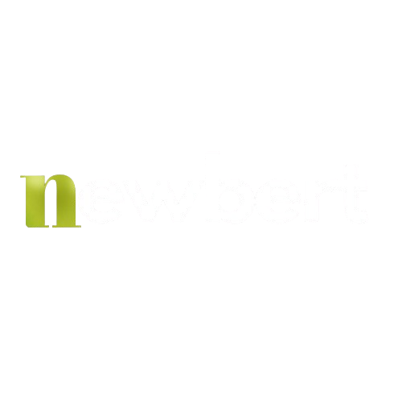
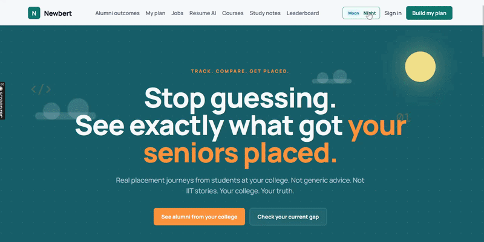
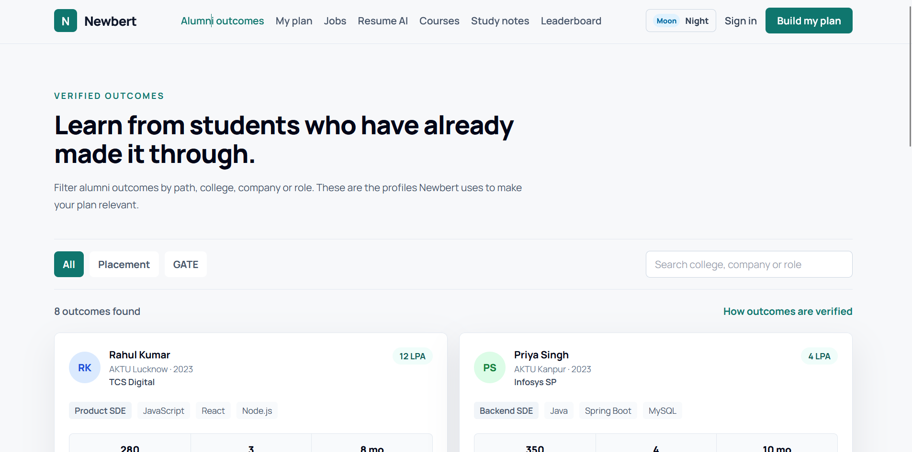
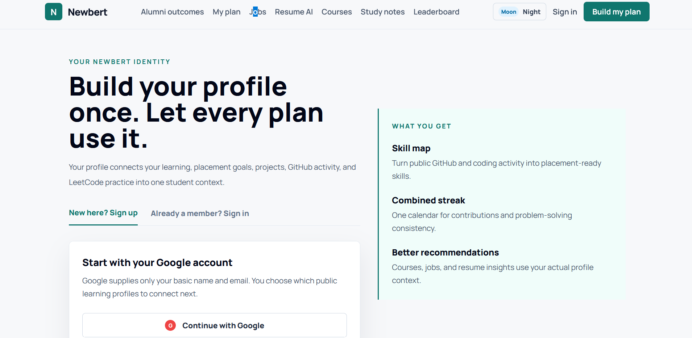
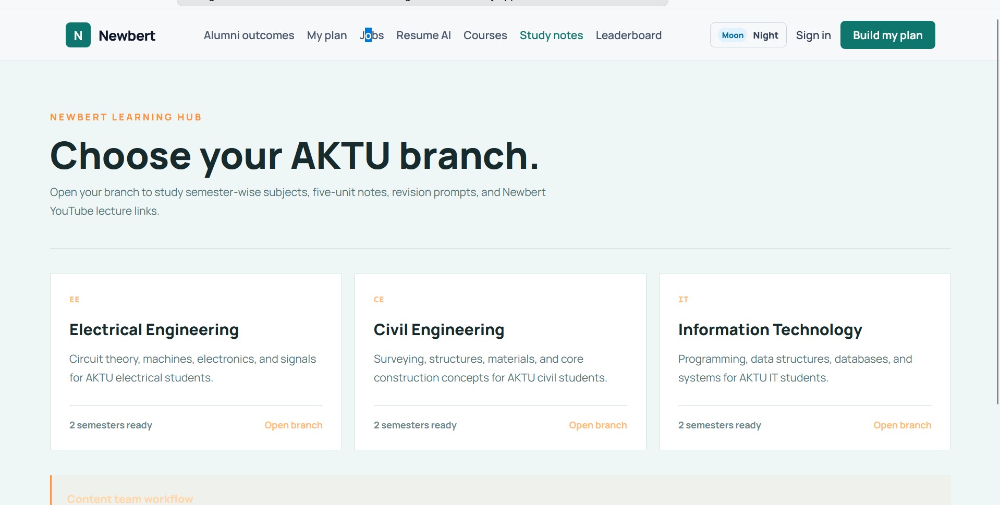
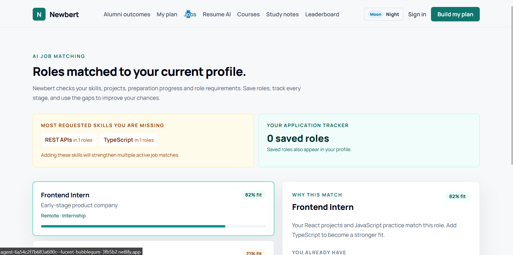
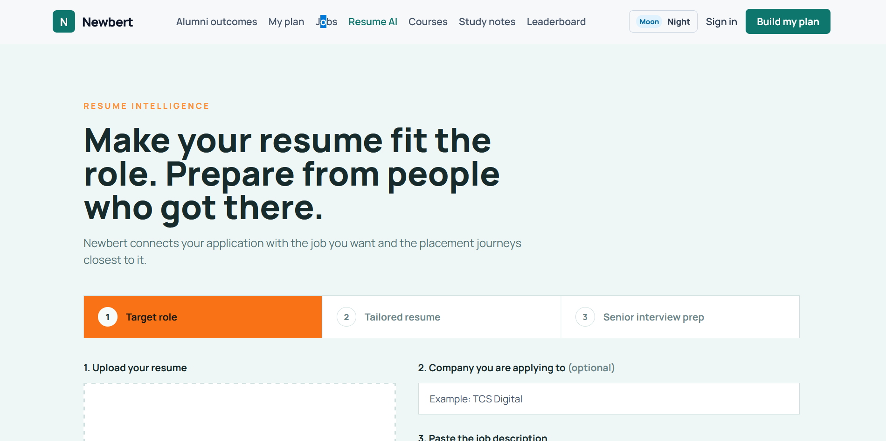
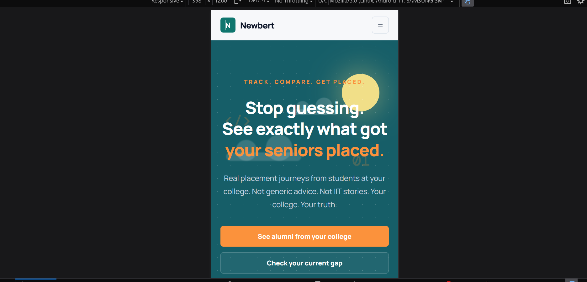

<p align="center">
  
</p>

<p align="center">
  <b>AI-powered Placement Intelligence Platform for Tier-2 & Tier-3 Students</b>
</p>

<p align="center">
  ⭐ Alumni Intelligence • 🤖 AI Resume • 📈 Placement Readiness • 💼 Smart Jobs
</p>

<p align="center">

<a href="https://agent-6a54c2f7b683a600c--lucent-bubblegum-3fb5b2.netlify.app/">

</a>

<a href="https://github.com/Anant23452/Newbert2.0">

</a>

</p>

---

## 🚀 Landing Page

<p align="center">
  
</p>

---

## 🖥️ Platform Screenshots

<table>
<tr>
<td width="50%" align="center">

### 🎓 Alumni Wall



</td>

<td width="50%" align="center">

### 👤 Profile Dashboard



</td>
</tr>

<tr>
<td width="50%" align="center">

### 📝 Notes



</td>

<td width="50%" align="center">

### 💼 Jobs



</td>
</tr>

<tr>
<td width="50%" align="center">

### 📄 Resume AI



</td>

<td width="50%" align="center">

### 📱 Responsive Design



</td>
</tr>
</table>

---

## ✨ Features

### 🎓 Alumni Wall
- Browse verified placement and GATE success stories.
- View company, package, DSA count, projects, tech stack, and preparation journey.
- Learn directly from seniors of your own college.

### 📊 AI Gap Analysis
- Compare your profile with placed alumni.
- Get a placement readiness score.
- Identify missing skills, DSA problems, projects, and internships.

**Example:**

```text
Placement Readiness: 62%

Missing:
• 120 DSA Problems
• 1 Full Stack Project
• React.js
• Internship Experience
